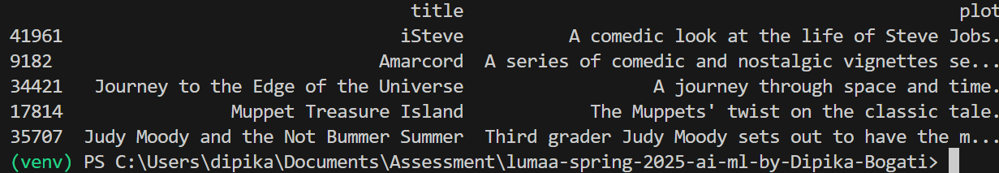

# AI/Machine Learning Intern Challenge: Simple Content-Based Recommendation

**Dataset Location**:
https://www.kaggle.com/datasets/samruddhim/imdb-movies-analysis

### Project Setup:

Firstly, the dataset is downloaded from the above location (https://www.kaggle.com/datasets/samruddhim/imdb-movies-analysis). The downloaded zip file is extracted into the project. The data folder is created inside the project and that downloaded csv file is copied inside the data folder. 

After that virtual environment is setup using the command: python -m venv venv. Then the virtual enviroment is activated and the dependencies are download from the requirements.txt file. Finally, main.py file is ran using: python main.py "I love thrilling action movies set in space, with a comedic twist.". It will display the output in the following way:

